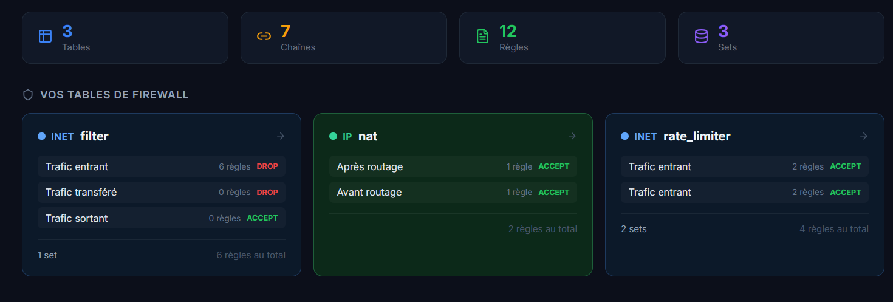
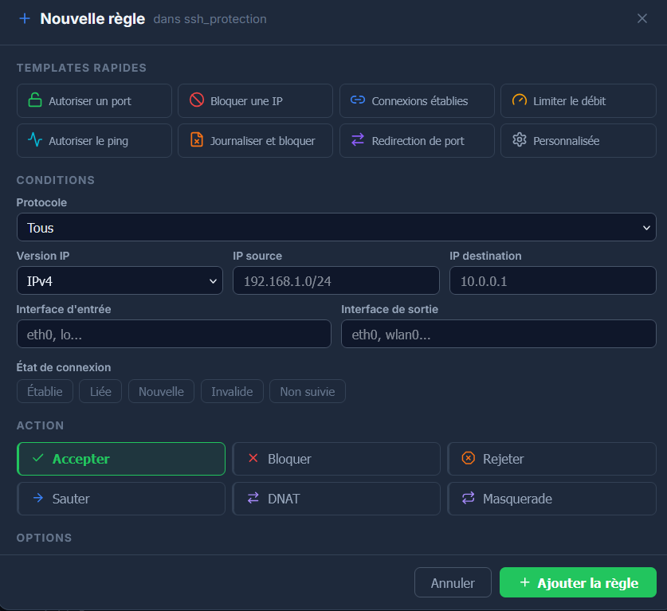
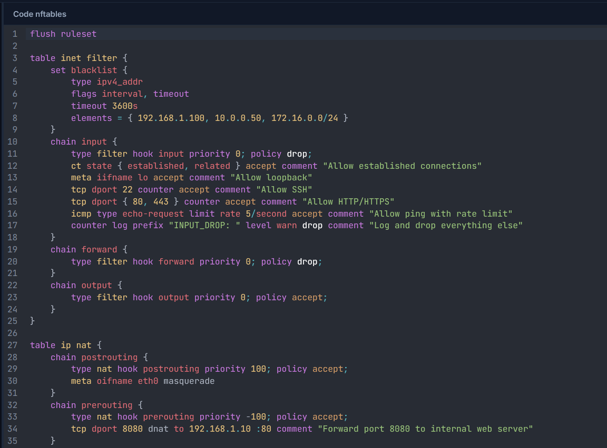
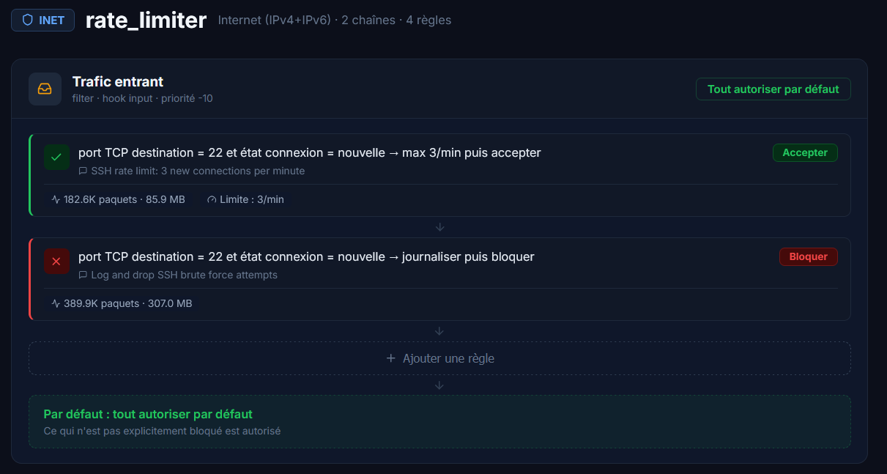
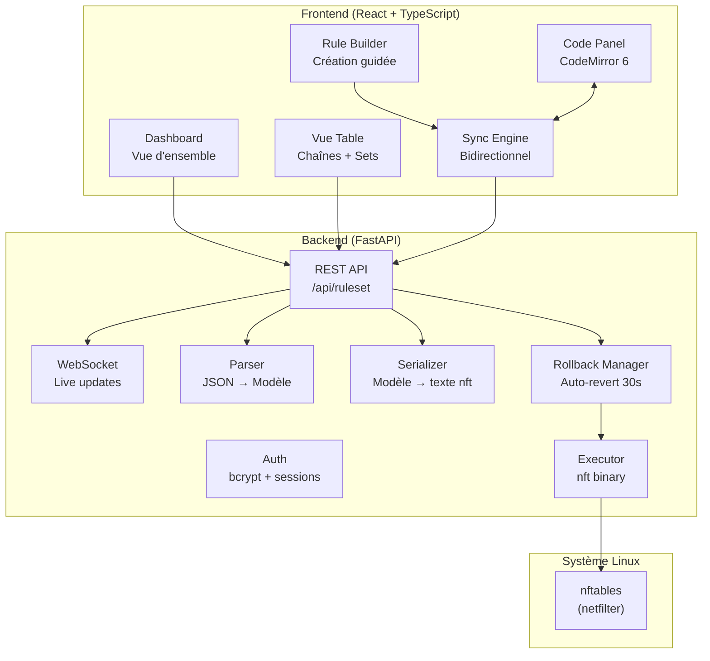

<p align="center">
  
</p>

<h1 align="center">Rempart</h1>

<p align="center">
  <strong>Configurez votre firewall Linux sans connaître la syntaxe nftables.</strong>
</p>

<p align="center">
  
  
  
</p>

<p align="center">
  Une interface visuelle pour gérer vos règles nftables en toute simplicité.<br/>
  Créez des règles en quelques clics. Le vrai code reste toujours visible — vous gardez le contrôle.
</p>

---

## Démarrage rapide

```bash
git clone https://github.com/MTBuilt/rempart.git
cd rempart
./start.sh        # Linux / macOS
```

Ouvrez **http://127.0.0.1:8443** — choisissez votre mot de passe au premier lancement. C'est tout.

> **Pas de Linux ?** Lancez `start.bat` sur Windows pour essayer en mode démo avec des données simulées.

---

## Ce que fait Rempart

### Visualisez vos règles en un coup d'oeil

Toutes vos tables, chaînes et règles s'affichent sur un dashboard clair. Chaque règle est traduite en français : plus besoin de déchiffrer la syntaxe nft.

<p align="center">
  
</p>

### Créez des règles sans écrire une ligne

Le Rule Builder propose 8 modèles prêts à l'emploi : autoriser un port, bloquer une IP, limiter le débit, NAT... Remplissez le formulaire, Rempart génère la règle.

Des **conseils de sécurité** s'affichent en temps réel : ports connus, alertes si une règle est risquée, bonnes pratiques.

<p align="center">
  
</p>

### Le code reste toujours visible

Pas de boîte noire. Le panneau de code montre le vrai nftables généré, avec coloration syntaxique. Modifiez l'interface, le code se met à jour. Modifiez le code, l'interface suit.

<p align="center">
  
</p>

### Appliquez sans risque

Le système de **rollback automatique** vous protège : après chaque modification, vous avez 30 secondes pour confirmer. Si vous ne confirmez pas (ou si vous perdez la connexion), les anciennes règles sont automatiquement restaurées.

<p align="center">
  
</p>

---

## Prérequis

- Python 3.11+
- Node.js 18+
- Linux avec nftables (ou Windows/macOS pour le mode démo)

### Installation manuelle

```bash
# Backend
cd backend && pip install -e . && python -m rempart

# Frontend (autre terminal)
cd frontend && npm install && npx vite
```

---

## Configuration

Copiez `.env.example` en `.env` pour personnaliser :

| Variable | Défaut | Description |
|----------|--------|-------------|
| `REMPART_MOCK_MODE` | `true` | Mode démo avec données simulées |
| `REMPART_PORT` | `8443` | Port du serveur |
| `REMPART_ROLLBACK_TIMEOUT` | `30` | Secondes avant rollback automatique |

Toutes les variables sont préfixées `REMPART_`. Voir `.env.example` pour la liste complète.

---

## Philosophie

> **Transparency First** — vous voyez toujours le vrai code.

Rempart a un double objectif :

1. **Accessibilité** : configurer un firewall sans connaître la syntaxe nftables
2. **Apprentissage** : en voyant le code généré, on apprend nftables progressivement

Ce n'est pas un outil qui cache la complexité — il la rend lisible.

---

<details>
<summary><strong>Documentation technique</strong></summary>

## Architecture



## Stack technique

| Couche | Technologie |
|--------|------------|
| Frontend | React 18 + TypeScript + Vite 5 |
| State | Zustand |
| Éditeur | CodeMirror 6 (Lezer) |
| Backend | FastAPI + Pydantic 2 |
| Auth | bcrypt + itsdangerous |
| Tests | pytest + vitest (93 tests) |

## Structure du projet

```
rempart/
├── backend/rempart/
│   ├── main.py             # Point d'entrée FastAPI
│   ├── config.py           # Configuration (env vars)
│   ├── api/                # REST endpoints (ruleset, apply)
│   ├── auth/               # Login, sessions, bcrypt
│   ├── nft/                # Parser, serializer, executor, rollback
│   └── ws/                 # WebSocket live updates
├── frontend/src/
│   ├── components/         # Dashboard, Detail, RuleBuilder, Editor
│   ├── state/              # Zustand stores
│   └── utils/              # humanize, serializer, sync engine
├── tests/                  # pytest + vitest
├── start.sh / start.bat    # Lanceurs one-command
└── .env.example
```

## API

| Méthode | Endpoint | Description |
|---------|----------|-------------|
| `POST` | `/api/auth/login` | Connexion |
| `POST` | `/api/auth/logout` | Déconnexion |
| `GET` | `/api/auth/me` | Session courante |
| `GET` | `/api/ruleset` | Ruleset JSON structuré |
| `GET` | `/api/ruleset/text` | Ruleset texte nft |
| `POST` | `/api/ruleset/parse` | Parse du texte nft |
| `POST` | `/api/apply` | Applique un ruleset (+ timer rollback) |
| `POST` | `/api/apply/confirm` | Confirme l'application |
| `POST` | `/api/apply/revert` | Annule et restaure |
| `GET` | `/api/apply/status` | État du rollback |

## Développement

```bash
# Tests
python -m pytest tests/backend -v    # Backend
cd frontend && npx vitest run         # Frontend
cd frontend && npx tsc --noEmit       # Type check

# Build production
cd frontend && npx vite build         # → backend/rempart/static/
```

### Mode mock

Sur les systèmes sans nftables, le **mode mock** simule un environnement complet en mémoire. Activé automatiquement par `start.bat` ou quand le binaire `nft` n'est pas trouvé.

</details>

---

## Licence

MIT — Voir [LICENSE](LICENSE)

<p align="center">
  Fait avec rigueur pour la communauté Linux francophone.
</p>
